<div align="center">

# PromptCard Studio for NovelAI

**一款本地优先的 NovelAI 提示词管理工具 —— 卡片化工作区 · NovelAI 生图 · 批量生成 · 发布前处理**

[](./LICENSE)
[]()
[]()
[]()
[]()
[]()

[快速开始](#快速开始) · [使用教程](#使用教程) · [功能模块](#功能模块) · [目录结构](#目录结构) · [参考来源](#参考来源) · [隐私与安全](#隐私与安全)

</div>

## 项目简介

一款本地优先的 NovelAI 提示词管理工具。把提示词整理成可复用的「卡片」，在工作区里快速组合、分类、拖拽，管理图片库与参考图 Vibe，并支持卡片组合批量生成和发布前处理（超分降噪 / 数据抹除 / 批量重命名）。下载解压即可使用，所有数据只保存在你自己的电脑上。

## 演示预览

点击图片或标题可跳到对应的教程章节。所有截图均为单个浏览器窗口内可见的一屏截图（不拼接、不用长截图、不用 GIF）。

<table>
<tr>
<td width="33%" align="center"><a href="#提示词工作台">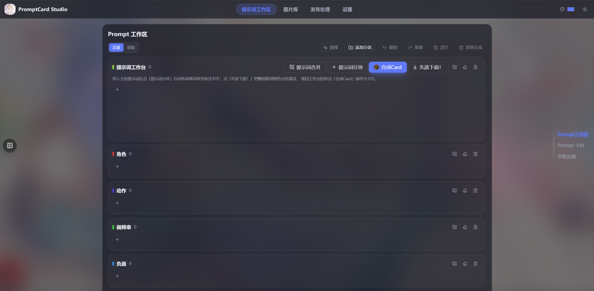</a><br /><a href="#提示词工作台"><strong>提示词工作台</strong></a></td>
<td width="33%" align="center"><a href="#图片库">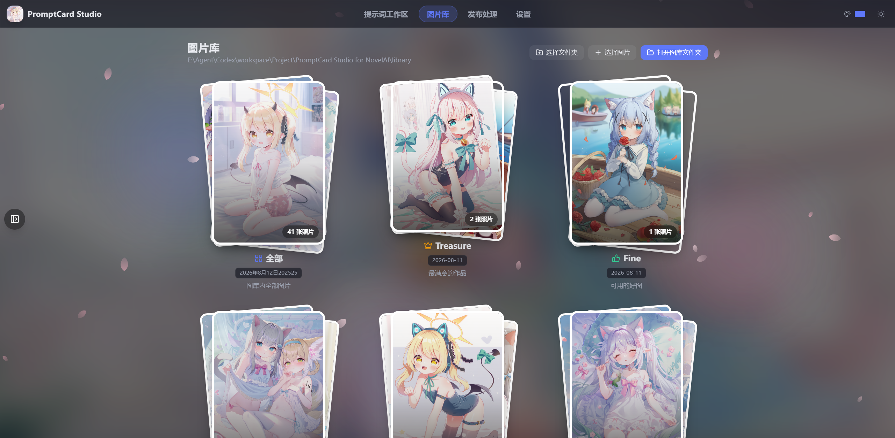</a><br /><a href="#图片库"><strong>图片库</strong></a></td>
<td width="33%" align="center"><a href="#发布处理">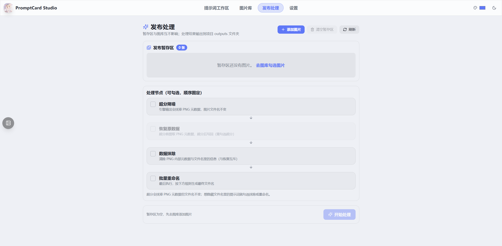</a><br /><a href="#发布处理"><strong>发布处理</strong></a></td>
</tr>
</table>

## 快速开始

1. 下载并解压本项目（Windows 用户）。
2. 双击 **run.bat**：仅首次需要，自动创建运行环境并安装依赖（之后无需再运行）。
3. 以后每次双击 **start_local.cmd** 启动，浏览器会自动打开 http://127.0.0.1:14419。
4. 停止服务：应用内「设置 → 关闭本地服务」。

脚本说明：

- `run.bat`（Windows）/ `run.sh`（macOS / Linux）：首次初始化，准备环境后自动启动；
- `start_local.cmd`：日常启动入口（Windows），端口被占用时自动更换。

小提示：

- 端口 14419 被占用时会自动更换端口，无需手动设置；
- 使用 NovelAI 生图前，请先在「设置」中填入你的 NovelAI Token（仅保存在本机）。

## 使用教程

下面按模块介绍如何使用本项目。

### 提示词工作台

工作台是核心编辑区，采用分区化块式布局：**提示词工作台 / 角色 / 动作 / 画师串 / 负面置底**。每个分区可以放入卡片引用或自由文本块，最终按顺序合并成一条完整提示词。

主要能力：

- **卡片引用 + 自由文本**：从「Prompt 卡包」点选或拖入卡片即生成引用，也可直接输入/粘贴任意文本块；
- **拖拽排序**：块与块之间拖动调整顺序，角色、动作、画师串区块按你的顺序输出；
- **撤销 / 重做**：编辑过程随时回退；
- **提示词分块（自动中文标注）**：一键把整段提示词拆成分区块，并借助本地词典自动打上中文标签；
- **中文翻译**：对英文标签自动标注/翻译成中文，方便检查语义；
- **合成卡片**：把当前工作区内容保存成一张新卡片；
- **多选移动 / 提示词合并**：批量把块合并到某个分区；
- **正面 / 背面切换**：正面提示词与负面提示词分开编辑、一键切换。

操作步骤：

1. 打开「提示词工作台」，点左下角「+ 文本块」或从卡包拖入卡片；
2. 粘贴一整段 NovelAI 提示词后点「分块」，观察各分区自动拆开并出现中文标注（见图1-1）；
3. 拖动块调整顺序，删除或合并不需要的部分；
4. 编辑完成后可点「合成卡片」存入卡包，下次直接引用。

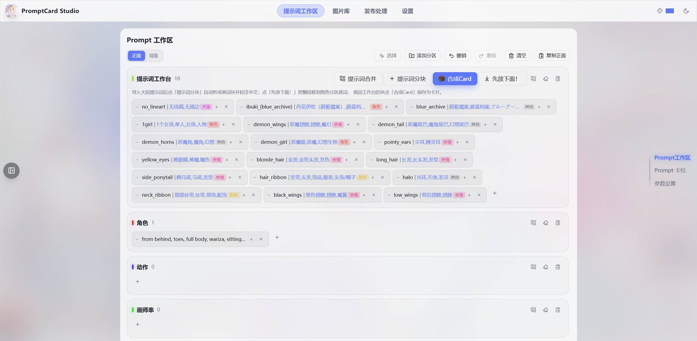

<!-- 【图1-3】此处需要：合成卡片弹窗（或正面/背面切换区域）的一屏截图，用于展示卡片化复用。建议命名：图1-3-提示词工作台-合成卡片.png -->

### Prompt 卡包

卡包是卡片的仓库，按分类管理：内置 **角色 / 动作 / 画师串 / 负面 / 质量 / 场景 / 表情 / 服装** 等分类，支持置顶、搜索，并可通过 xlsx 模板批量导入。

主要能力：

- **分类管理**：新建/重命名分类，卡片置顶，分类配色与显示顺序可调；
- **批量导入**：用内置 `卡片导入模板.xlsx` 填写「分类 / 名称 / 提示词 / 图片（可选）」，一键导入，同名自动加后缀；
- **导出 zip**：把选中的卡片打包成 zip 分享或备份；
- **卡片图片**：每张卡片可配图片，展示时更直观。

操作步骤：

1. 打开「Prompt 卡包」，在左侧选择或新建分类；
2. 点「新建卡片」，填写名称与提示词（可附图片），保存后卡片出现在列表中（见图2-2）；
3. 需要批量导入时，点「批量导入」下载模板，按列填好后上传；
4. 在卡包中点卡片即可加入工作台，常用卡片可置顶。

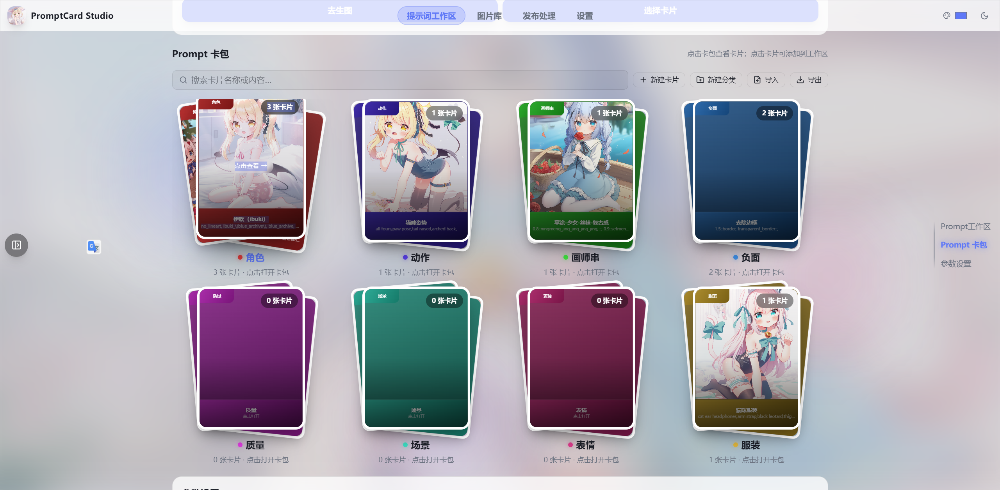

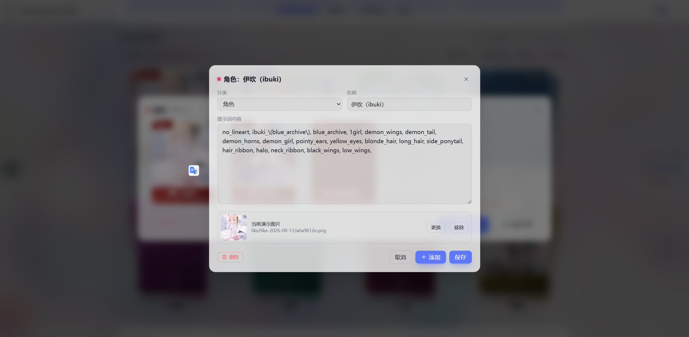

### 提示词词典

词典为本地中文标注工具：按 **Danbooru 标签** 分类，自动为标签着色并附带中文备注，供工作台「分块」时自动打标签和翻译使用。

主要能力：

- **自动着色**：不同分类（角色/动作/画师串/质量/负面等）显示不同颜色，一眼区分；
- **中文备注**：每条标签附中文释义，悬停即可查看；
- **未知词手动添加**：词典里没有的标签可手动录入，保存后同样参与自动标注。

操作步骤：

1. 在「提示词工作台」粘贴提示词并点「分块」，词典会自动识别标签并标注中文（着色与备注效果见图1-1）；
2. 分块后可以编辑提示词块，并把块或其中的标签加入词典（见图3-2）；
3. 遇到未收录的标签，可在编辑块时直接添加词条补充中文备注。

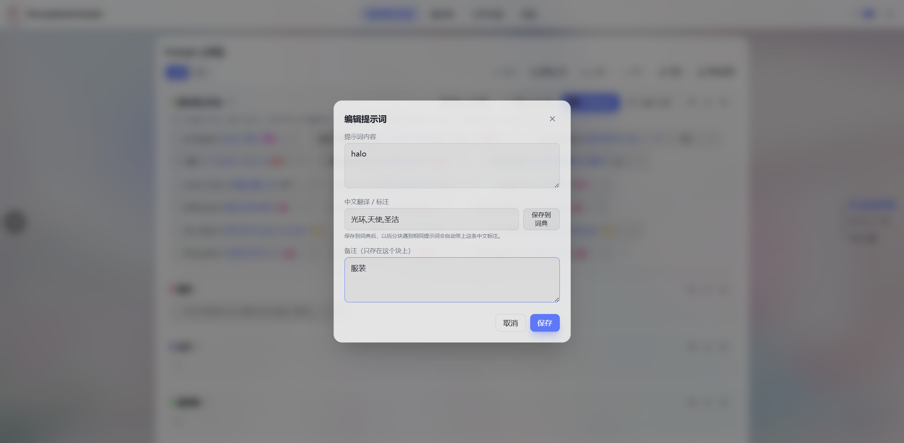

### NovelAI 生图

在工作台组合好提示词后，可直接调用 NovelAI 生成单张图片。

主要能力：

- **完整参数**：模型 / 分辨率 / 步数 / 采样器 / 负面预设 / 质量词 / Variety / Vibe 参考 / 多角色；
- **参数自动记忆**：上次使用的参数自动保留，无需反复设置；
- **免费档自动判定**：自动识别当前账号免费档对应的参数范围；
- **结果回库**：生成结果可一键保存到图片库，PNG 信息（提示词/种子）完整保留。

操作步骤：

1. 先在「设置」中填入 NovelAI Token（仅存本机）；
2. 在工作台组合好提示词，可勾选 Vibe 参考图；
3. 打开生图面板，选择模型、分辨率、步数、采样器等参数（见图4-1）；
4. 点「生成」，等待结果；完成后可预览、重试或保存到图片库（见图4-2）。

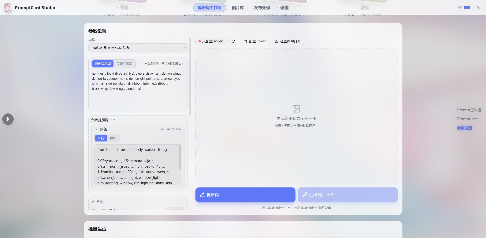

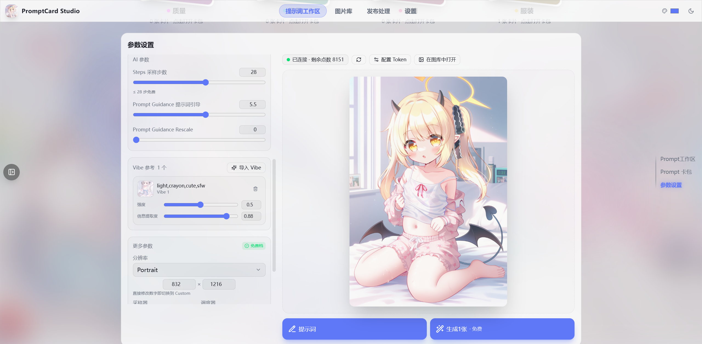

### 批量生成

把「角色 × 动作 × 画师串」等维度组合起来批量枚举生成，适合一次跑一批候选图。

主要能力：

- **组合枚举**：角色、动作、画师串三个维度（可加自定义维度）自动排列组合；
- **每卡系数**：每张卡可设置权重系数，控制组合时的重复次数；
- **串行生成**：按队列逐张生成，避免并发触发限制；
- **点数停止阈值**：剩余点数低于阈值自动停止，防止超额消耗；
- **断点续跑**：中断后可从中断位置继续，不重复生成。

操作步骤：

1. 打开「批量生成」面板，勾选要参与的角色/动作/画师串（见图5-1）；
2. 设置每卡系数、停止阈值与生成参数；
3. 点「开始」串行生成，随时可暂停；再次开始会从断点继续；
4. 结果进入图片库，可按日期分组查看。

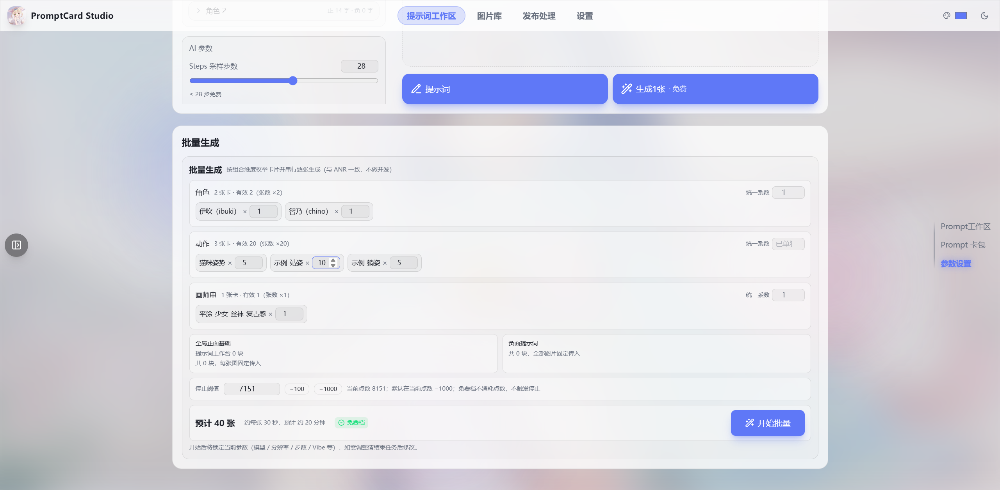

### 图片库

图片库管理所有本地生成/导入的图片，与 NovelAI 的 PNG 信息深度打通。

主要能力：

- **瀑布流 + 日期分组**：按日期归档浏览，滚动加载；
- **筛选模式**：Treasure / Fine / Reject / 收藏 分类筛选，快速整理；
- **PNG 信息还原**：读取图片里的提示词、参数与种子，一键完整还原到工作区（见图6-2）；
- **快速导入 / 移动 / 删除**：本地图片拖入即入库，支持批量移动与删除；
- **分类封面**：可把任意图片设为分类封面。

操作步骤：

1. 把图片拖入图片库或点「导入」选择本地文件；
2. 用顶部筛选模式整理：好图标 Treasure，废图标 Reject（图库首屏见图0-2，与演示预览同一张）；
3. 想复刻某张图时，选中它点「还原到工作区」，提示词与参数自动填回，读取 PNG 参数的效果见图6-2；
4. 需要整理时，用右键/操作菜单移动、删除或设置封面（以文字说明为准，未配图）。


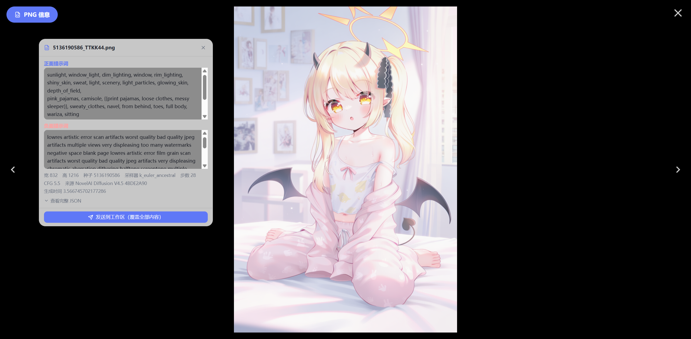

### 发布处理

发布前处理是一个独立流程：把选中的图片放入暂存区，按固定节点处理后输出，适合批量发布图片到社交平台前统一清理与命名。

主要能力：

- **独立暂存区**：从图库勾选 →「快捷选取 → 发布处理」，以硬链接秒级复制进暂存区，原图不动；发布页可预览 / 删除 / 清空 / 添加；
- **固定节点顺序**：超分降噪 → 恢复原数据 → 数据抹除 → 批量重命名；
- **超分降噪**：支持 Real-ESRGAN（ncnn-Vulkan，可自动下载，带校验与断点续传）与 waifu2x-caffe（本地路径接入）；
- **恢复原数据**：超分后把原图的提示词/参数写回，图片变清晰但信息不丢；
- **数据抹除**：null 覆写清除其余块，NovelAI 等读取器读到为空；JPEG 同时清除 EXIF/XMP；
- **批量重命名**：日期（可选）_ 自定义段（可选）_ 随机数字段（6 位），三段可拖动换序、实时预览；
- **输出**：结果输出到 `outputs/<时间戳>-<随机>/` 独立文件夹，完成后一键「打开输出文件」。

操作步骤：

1. 在图片库勾选要发布的图，点「快捷选取 → 发布处理」，图片进入暂存区（见图7-1）；
2. 在发布页检查暂存区，可预览、删除或继续添加；
3. 按顺序配置节点：选择超分引擎与参数（Real-ESRGAN / waifu2x-caffe，可选）、勾选恢复原数据/数据抹除（以文字说明为准，未配图）；
4. 配置重命名规则，右侧实时预览文件名（见图7-3）；
5. 点「开始处理」，完成后点「打开输出文件」查看结果（见图7-4）。

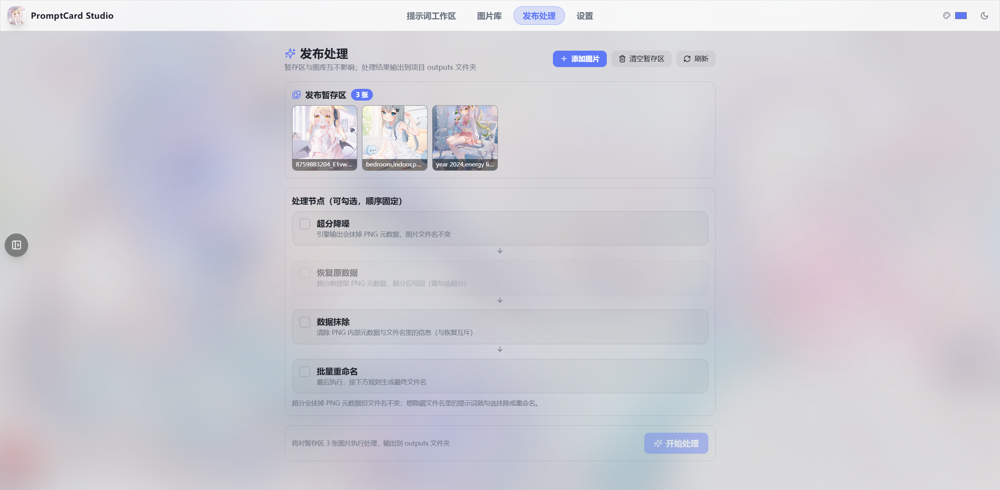

<!-- 【图7-3】此处需要：批量重命名规则与实时预览的一屏截图（日期/自定义/随机数字段可拖动换序），用于展示重命名功能。建议命名：图7-3-发布处理-重命名预览.png -->
<!-- 【图7-4】此处需要：处理完成后的输出提示（或 outputs/ 文件夹内容）的一屏截图，用于展示发布输出。建议命名：图7-4-发布处理-输出结果.png -->

### Vibe 管理

Vibe 是 NovelAI 的参考图机制。本项目提供 Vibe 库管理，导入后可在生图/批量生成时作为参考。

主要能力：

- **Vibe 库**：统一存放 `.naiv4vibe` 参考图文件；
- **导入 / 重命名 / 预览**：批量导入，重命名后更易识别，缩略图直接预览；
- **生图引用**：生图面板中直接勾选 Vibe 作为参考。

操作步骤：

1. 打开「Vibe 管理」，点「导入」选择 `.naiv4vibe` 文件（见图8-1）；
2. 在列表中预览并重命名；
3. 生图或批量生成时在面板中勾选需要的 Vibe。

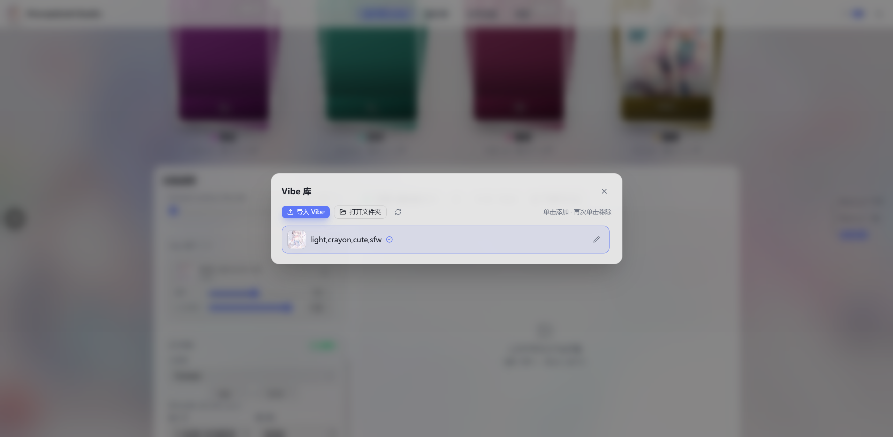

### 设置

设置页集中管理外观、路径、账号与功能开关。

主要能力：

- **主题与背景图**：深色/浅色主题、玻璃效果强度、内置背景图切换；
- **图库路径**：默认使用项目内 `library/`，可改为任意绝对路径；
- **NovelAI Token**：仅保存在本机 `config.json`，不会写入日志或提交记录；
- **功能开关**：特效、多角色、中文翻译、自动备注等；
- **关闭本地服务**：在应用内一键停止后端。

操作步骤：

1. 打开「设置」，先配置外观与图库路径（见图9-1）；
2. 填入 NovelAI Token，开启中文翻译与自动备注（见图9-2）；
3. 不需要服务时点「关闭本地服务」安全退出。

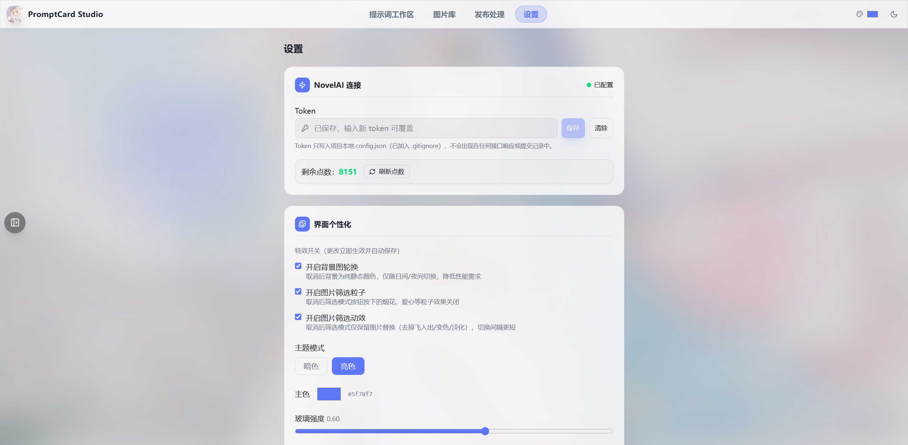

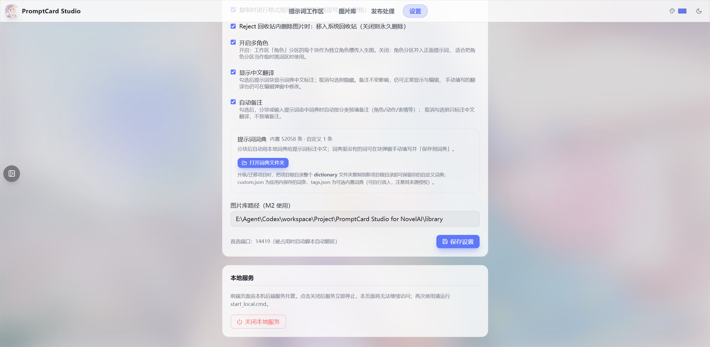

## 功能模块

- **Prompt 工作区**：分区化块式工作区（提示词工作台 / 角色 / 动作 / 画师串 / 负面置底），卡片引用 + 自由文本块，支持拖拽排序、撤销/重做、提示词分块（自动中文标注）、合成卡片、多选移动、提示词合并、正面/背面切换。
- **Prompt 卡包**：按分类管理卡片，支持置顶；用内置 xlsx 模板批量导入（分类 / 名称 / 提示词 / 图片可选，同名自动加后缀），支持导出 zip。
- **提示词词典**：本地中文标注，按 Danbooru 标签分类自动着色与备注；未知词可手动添加。
- **NovelAI 生图**：单张生成，支持模型 / 分辨率 / 步数 / 采样器 / 负面预设 / 质量词 / Variety / Vibe 参考 / 多角色，参数自动记忆，免费档自动判定。
- **批量生成**：角色 × 动作 × 画师串（可加自定义维度）组合枚举、每卡系数、串行生成、点数停止阈值、断点续跑。
- **图片库**：瀑布流、日期分组、筛选模式（Treasure / Fine / Reject / 收藏）、读取 PNG 信息并完整还原到工作区、快速导入 / 移动 / 删除、分类封面。
- **发布处理**：勾选图片进入独立暂存区，按节点处理：超分降噪（Real-ESRGAN 或 waifu2x-caffe）→ 恢复原数据 → 数据抹除（NovelAI 等读取器读到为空）→ 批量重命名（日期 / 自定义段 / 随机数字段可拖动换序）；输出到 `outputs/` 独立文件夹。
- **Vibe 管理**：参考图 Vibe 库导入、重命名、预览。
- **设置**：主题、背景图、图库路径、NovelAI Token、特效开关、多角色、中文翻译、自动备注等。

## 目录结构

仓库自带的内容（解压即见）：

```
backend/          项目后端（FastAPI）：卡片/工作区/词典/生图/批量/图库/Vibe/PNG 发送/发布处理
  └ app/assets/   卡片导入模板（xlsx）
  └ app/engines/  超分引擎清单（*.json）与运行时下载目录（runtime/，首次使用时下载）
frontend/         项目前端（React 18 + TypeScript + Vite + Tailwind v4 + Zustand）
  └ src/assets/backgrounds/  内置背景图
dictionary/       tag 词典（tags.json，随版本更新）
promptcards/      提示词卡片（<分类>/<名称>.txt 及元数据，内置演示卡片）
library/          本地图库（内置图库样例）
vibes/            参考图 Vibe 库（内置演示 vibe）
images/           README 教程截图（仅文档用）
LICENSE           开源协议（GPL-3.0）
README.md         项目说明
run.bat / run.sh  初次启动（Windows / macOS、Linux）
start_local.cmd   日常启动入口（Windows）
start_local.ps1   日常启动脚本（由 start_local.cmd 调用）
.gitignore        忽略用户数据，防止误提交
```

运行后生成或由你添加的用户数据（已加入 `.gitignore`，不会进入仓库）：

```
promptcards/      你添加的卡片（新增内容不入库）
library/          你的图片库（新增内容不入库）
vibes/            你的参考图（新增内容不入库）
batch_runs/       批量生成断点记录
publish_staging/  发布处理暂存区
publish_runs/     发布处理运行内部暂存
outputs/          发布处理输出
dictionary/custom.json  用户自定义词典词条
config.json / workspace.json  本地配置与工作区数据
```

## 参考来源

- NovelAI 接口与批量生成参考 **Auto-NovelAI-Refactor（ANR）**（https://github.com/zhulinyv/Auto-NovelAI-Refactor ，GPL-3.0）。依据 GPL-3.0，本项目以 GPL-3.0 整体开源（见 `LICENSE`）。
- 提示词中文词典由 **DanbooruSearchOnline（DSO）** 的标签库转换而来（https://github.com/SuzumiyaAkizuki/DanbooruSearchOnline ，标签数据完全开源）。
- 超分引擎：**Real-ESRGAN**（https://github.com/xinntao/Real-ESRGAN ，BSD-3-Clause，按需下载）；可选 **waifu2x-caffe**（https://github.com/lltcggie/waifu2x-caffe ，MIT，本地路径接入）。

## 隐私与安全

- 应用完全本地运行：除你主动触发的 NovelAI 生成请求外，不会向任何外部服务发送数据；超分引擎仅在勾选时从官方或镜像源下载。
- NovelAI Token 仅保存在本机配置文件中，不会出现在接口响应、日志或提交记录中；配置与全部用户数据目录均已加入 `.gitignore`，不会进入仓库。
- 请勿将你的 Token、配置或本地数据目录提交到任何公开仓库。
