<div align="center">

[简体中文](README.md) | **English** | [日本語](README_JA.md)

# PromptCard Studio for NovelAI

**A local-first NovelAI prompt manager — Card-based workspace · NovelAI generation · Batch generation · Pre-publish processing · Style exploration**

[](./LICENSE)
[]()
[]()
[]()
[]()
[]()
[](https://space.bilibili.com/325112027)

QQ group: 542213051

[Quick Start](#quick-start) · [User Guide](#user-guide) · [Feature Overview](#feature-overview) · [Directory Structure](#directory-structure) · [Credits](#credits) · [Privacy and Security](#privacy-and-security)

</div>

## About

PromptCard Studio is a local-first NovelAI prompt manager. Organize prompts as reusable cards, quickly combine, categorize, and reorder them in the workspace, manage your image library and Vibe references, generate card combinations in batches, and prepare images for publishing with upscaling, automatic mosaics, metadata removal, and batch renaming. Download, extract, and run it locally—your data stays on your own computer.

The **Style Exploration** module introduced in v1.2.0 generates artist-string candidates from an ArtistPool, then helps you progressively converge on your own style through filtering, crossover, mutation, and family-based backcrossing. Watch the feature demo at https://www.bilibili.com/video/BV1ru8Y6gE3L/.

> **Platform support:** Windows 10/11 64-bit is currently the primary tested and officially supported platform. Startup scripts for macOS and Linux remain available as experimental options, but they are not tested to the same extent and continued compatibility is not guaranteed.

## Preview

Click an image or its title to jump to the corresponding guide.

<table>
<tr>
<td width="25%" align="center"><a href="#prompt-workspace"></a><br /><a href="#prompt-workspace"><strong>Prompt Workspace</strong></a></td>
<td width="25%" align="center"><a href="#image-library"></a><br /><a href="#image-library"><strong>Image Library</strong></a></td>
<td width="25%" align="center"><a href="#style-exploration">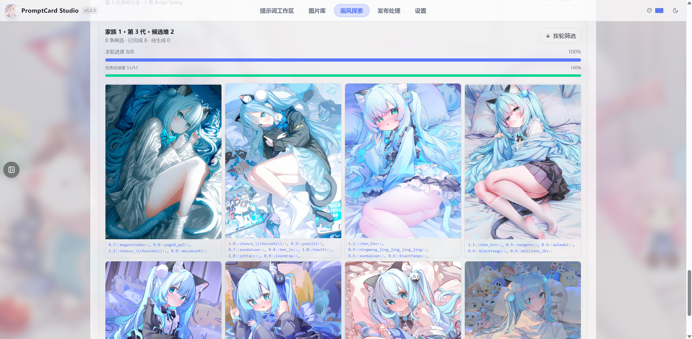</a><br /><a href="#style-exploration"><strong>Style Exploration</strong></a></td>
<td width="25%" align="center"><a href="#publish-processing"></a><br /><a href="#publish-processing"><strong>Publish Processing</strong></a></td>
</tr>
</table>

## Quick Start

1. Install Python 3.10 or later from https://www.python.org/downloads/. Select **Add Python to PATH** during installation. Use standard CPython; experimental free-threaded/no-GIL builds are not currently supported.
2. Download and extract this project.
3. On Windows, double-click **run.bat**. On macOS or Linux, you may try **run.sh** (experimental support). On first launch, the script creates the runtime environment, installs dependencies, starts the service, and opens the browser. Use the same script for future launches.
4. To stop the service, open **Settings** (`设置`) and select **Shut Down Local Service** (`关闭本地服务`).

### Upgrading and Migrating Data

After startup, the app checks for official GitHub releases in the background. You can also check manually under **Settings → Updates and Migration** (`设置 → 更新与迁移`). When a new version is available, open its release notes and download the new portable package. The app never overwrites the current project or deletes the old directory automatically.

After downloading and launching the new version, go to **Settings → Updates and Migration → Select Old Project Folder** (`设置 → 更新与迁移 → 选择旧项目文件夹`) and select the old project directory. The migration tool copies cards, the image library, Vibes, settings, custom dictionary data, backgrounds, engine runtimes, and plugin runtime data. Program code, dependencies, and build output are not migrated. Files with matching names are backed up to `.migration-backups/<timestamp>/`, and the Settings page displays the exact backup location. When migration finishes, use **Quick Restart Project** (`快速重启项目`) to apply everything. Once you have confirmed that the new version contains all expected data, you may manually remove the backup and old project directories.

Startup scripts:

- `run.bat` (Windows) and `run.sh` (macOS/Linux, experimental) are the only startup entry points. They prepare the environment, install dependencies, launch the service, and automatically choose another port if the default is occupied.

Tips:

- If environment setup fails, try the ready-to-use portable package from the Releases page.
- The first source-based launch needs internet access to install dependencies. Prebuilt frontend assets are included, so Node.js is not required.
- If port 14419 is already occupied, the launcher automatically selects another port.
- If a free-threaded/no-GIL Python build is detected, the launcher automatically rebuilds the environment with standard CPython.
- Before generating images with NovelAI, enter your NovelAI Token in **Settings** (`设置`). It is stored locally only.

## User Guide

The following sections explain each major module. English names are followed by the corresponding Chinese UI label where useful.

### Prompt Workspace

The Prompt Workspace (`提示词工作台`) is the main editing area. It uses separate block-based sections for the **main prompt, characters, actions, artist strings, and negative prompt**. Each section can contain card references or free-text blocks, which are merged in order into the final prompt.

Key features:

- **Card references and free text:** Click or drag a card from the Prompt Card Library to create a reference, or type and paste any free-text block.
- **Drag-and-drop ordering:** Reorder blocks and control the output order of character, action, and artist-string sections.
- **Undo and redo:** Revert or restore workspace edits at any time.
- **Prompt splitting with automatic Chinese labels:** Split a full prompt into categorized blocks and label recognized tags with the local dictionary.
- **Chinese translation:** Automatically annotate or translate English tags into Chinese for easier review.
- **Create combined cards:** Save the current workspace content as a reusable card.
- **Multi-select move and merge:** Move or merge multiple blocks into a selected section.
- **Positive/negative switching:** Edit positive and negative prompts separately and switch between them with one click.

Steps:

1. Open **Prompt Workspace** (`提示词工作台`), click **+ Text Block** (`+ 文本块`) in the lower-left corner, or drag a card in from the card library.
2. Paste a complete NovelAI prompt and click **Split** (`分块`). The content is separated into sections and recognized tags receive Chinese annotations (Figure 1-1).
3. Drag blocks to reorder them, then remove or merge anything you do not need.
4. When finished, click **Create Combined Card** (`合成卡片`) to save the result in the card library for reuse.


<!-- [Figure 1-3 needed] Capture the Create Combined Card dialog, or the positive/negative switch area, to demonstrate card-based reuse. Suggested filename: 图1-3-提示词工作台-合成卡片.png -->

### Prompt Card Library

The Prompt Card Library (`Prompt 卡包`) stores cards by category. Built-in categories include **characters, actions, artist strings, negative prompts, quality, scenes, expressions, and clothing**. Cards can be pinned and searched, and an XLSX template supports bulk import.

Key features:

- **Category management:** Create or rename categories, pin cards, and adjust category colors and display order.
- **Bulk import:** Fill in the built-in `卡片导入模板.xlsx` template with category, name, prompt, and optional image columns, then import everything at once. Duplicate names receive an automatic suffix.
- **ZIP export:** Package selected cards into a ZIP file for sharing or backup.
- **Card images:** Attach an image to each card for easier visual recognition.

Steps:

1. Open **Prompt Card Library** (`Prompt 卡包`) and select or create a category in the left panel.
2. Click **New Card** (`新建卡片`), enter a name and prompt, optionally attach an image, and save. The card appears in the list (Figure 2-2).
3. For bulk import, click **Bulk Import** (`批量导入`), download the template, fill in its columns, and upload it.
4. Click a card to add it to the workspace. Pin cards you use frequently.


### Prompt Dictionary

The Prompt Dictionary (`提示词词典`) is a local Chinese annotation tool. It categorizes **Danbooru tags**, colors them by type, and attaches Chinese notes used by the workspace when splitting and translating prompts.

Key features:

- **Automatic coloring:** Different categories—such as characters, actions, artist strings, quality, and negative tags—use different colors.
- **Chinese notes:** Hover over a tag to see its Chinese meaning.
- **Manual entries:** Add missing tags manually; saved entries also participate in automatic annotation.

Steps:

1. Paste a prompt into **Prompt Workspace** and click **Split** (`分块`). The dictionary recognizes tags and adds Chinese labels (see Figure 1-1).
2. Edit a prompt block after splitting and add the block or individual tags to the dictionary (Figure 3-2).
3. When a tag is missing, add it directly while editing the block and provide a Chinese note.


### NovelAI Image Generation

After assembling a prompt in the workspace, you can send it directly to NovelAI to generate a single image.

Key features:

- **Full parameter controls:** Model, resolution, steps, sampler, negative preset, quality tags, Variety, Vibe references, and multi-character settings.
- **Automatic parameter memory:** The previous settings are retained, so they do not need to be entered again.
- **Save results to the library:** Save generated images directly to the Image Library while preserving PNG metadata such as prompts and seeds.

Steps:

1. Enter your NovelAI Token under **Settings** (`设置`). It is stored locally only.
2. Assemble your prompt in the workspace and optionally select Vibe references.
3. Open the generation panel and choose the model, resolution, steps, sampler, and other parameters (Figure 4-1).
4. Click **Generate** (`生成`). When generation finishes, preview, retry, or save the result to the Image Library (Figure 4-2).


### Batch Generation

Batch Generation enumerates combinations such as **character × action × artist string**, making it useful for producing a large set of candidates in one run.

Key features:

- **Combination enumeration:** Automatically combine the character, action, and artist-string dimensions, with optional custom dimensions.
- **Per-card multiplier:** Give each card a multiplier to control how often it participates in combinations.
- **Sequential generation:** Process the queue one image at a time to avoid concurrent-request limits.
- **Credit threshold:** Stop automatically when remaining credits fall below the configured threshold.
- **Resume support:** Continue from the interruption point without regenerating completed items.

Steps:

1. Open **Batch Generation** (`批量生成`) and select the characters, actions, and artist strings to include (Figure 5-1).
2. Set card multipliers, the stop threshold, and generation parameters.
3. Click **Start** (`开始`) to process the queue. You may pause at any time; starting again resumes from the checkpoint.
4. Results are added to the Image Library and can be browsed by date.


### Style Exploration

Style Exploration (`画风探索`) creates different Artist Strings from an ArtistPool under consistent prompts and generation parameters. Use Basic Exploration to broaden the sample set, then use Treasure results as parents for crossover, mutation, and family-based backcrossing until the style converges toward your target.

Key features:

- **Independent exploration tasks:** Each task retains its own prompts, generation parameters, ArtistPool, candidate images, and lineage, and can be paused and resumed.
- **Basic Exploration:** Randomly combine artist IDs from the ArtistPool and generate weighted artist-string candidates.
- **Exploration Gallery:** Sort results into Treasure, Special, and Reject. Treasure items can become parents for Deep Exploration.
- **Deep Exploration:** Apply crossover and random mutation around a selected parent set, with optional preference ranking and custom Artist Strings.
- **Families and aesthetic branches:** Each regular parent set forms an independent family. Backcross selected offspring with the family's first-generation parents to converge on a particular aesthetic direction over successive generations.
- **Additional rounds within a generation:** Reuse the same parent relationship to generate another sibling round when the current sample set is insufficient.
- **Reuse results:** Enlarge candidates, create artist-string cards, or copy images to the regular Image Library.

#### Basic Exploration

1. Open **Style Exploration** (`画风探索`) and create or select an exploration task. Select an ArtistPool in the left panel or import one from a TXT file. Positive and negative prompts can be imported from the workspace or edited independently on this page (Figure 10-1).
2. Configure the model, dimensions, sampler, artist count, and weight distribution. With a NovelAI V5 model, try setting the weight **mode** (`众数`) to around `0.4` as a starting point, then adjust it based on the results (Figure 10-2).
3. Create a Basic Exploration round and click **Start Generation** (`开始生成`). Results appear under the current task's candidates, and completed images can be marked before the entire run finishes (Figure 10-3).
4. Click any candidate to enlarge it and inspect its Artist String. You can create an artist-string card directly and save it to the Prompt Card Library (Figure 10-4).

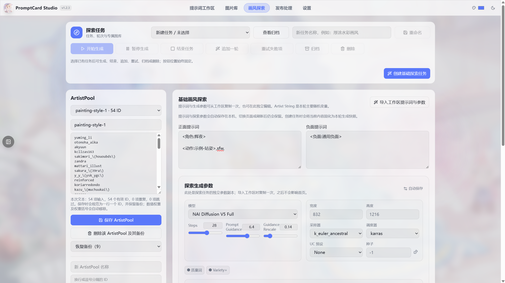

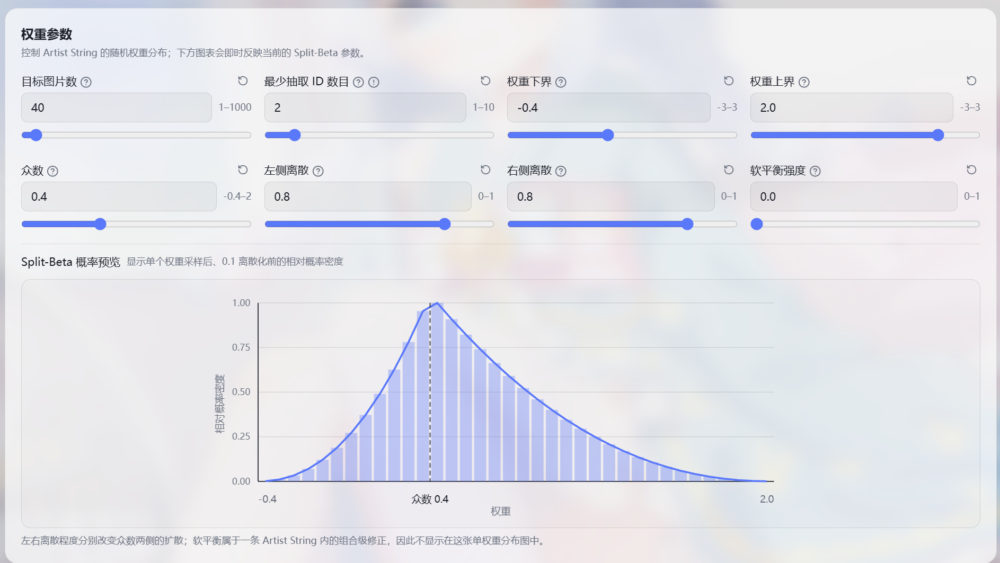

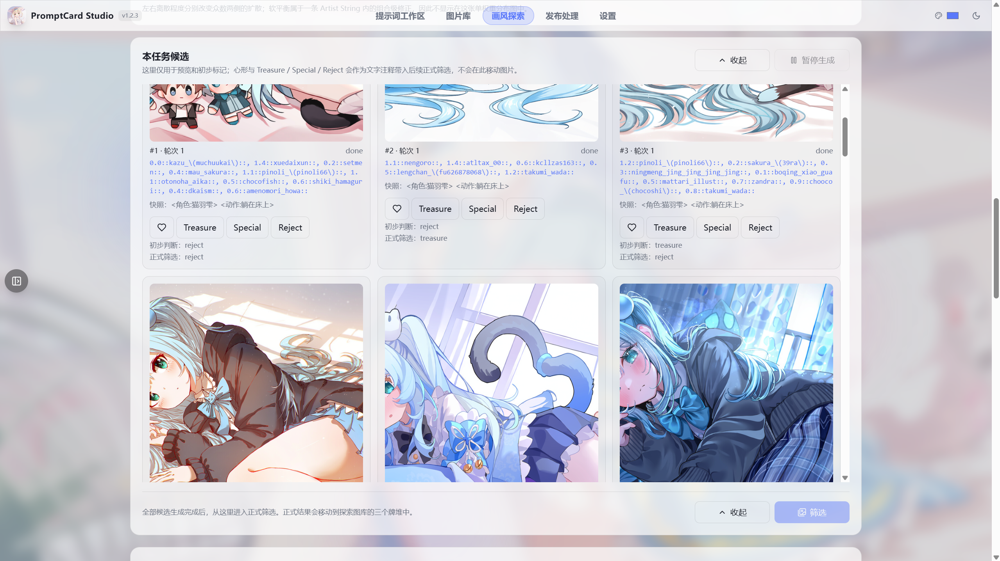

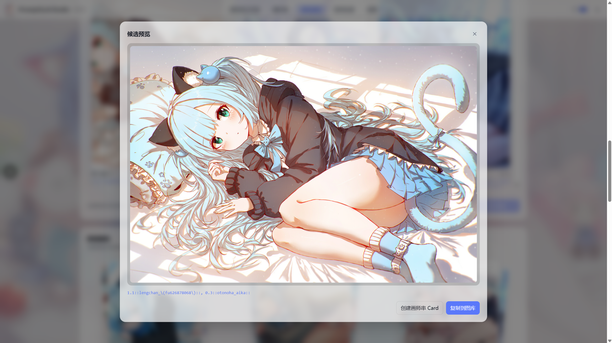

#### Filtering and the Exploration Gallery

After a Basic Exploration round, enter the formal filtering view and sort images into the task's three dedicated galleries (Figure 10-5):

- **Treasure:** Results you like and want to evolve further. These can become parent sources for Deep Exploration.
- **Special:** Distinctive results worth keeping, but not used as parents in this exploration.
- **Reject:** Results that do not match the current goal.

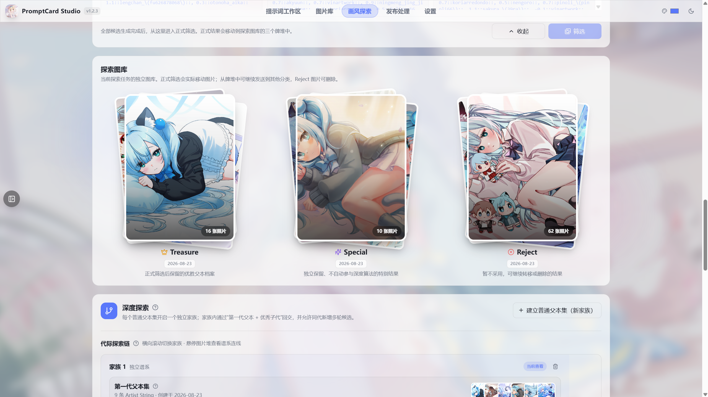

#### Deep Exploration

1. Select images from the current task's Treasure gallery and create a regular parent set. You may also add custom Artist Strings. The parent strings are crossed and randomly mutated to produce new candidates (Figure 10-6).
2. After generating a round, click **New Branch** (`新建分支`) beside a candidate stack when it contains offspring that fit your goal. Select the best offspring and name the aesthetic direction. The selected offspring are backcrossed with the family's first-generation parents, allowing later generations to converge further (Figure 10-7).
3. If the current generation has too few samples or no ideal result yet, click **Add Round** (`新增一轮`) to reuse the same parent relationship and create another sibling group (Figure 10-8).
4. Click any candidate stack to view the progress of that round, the overall task progress, and every candidate in the stack (Figure 10-9). Click a candidate to enlarge it, create an artist-string card, or copy it to the regular Image Library (Figure 10-10).

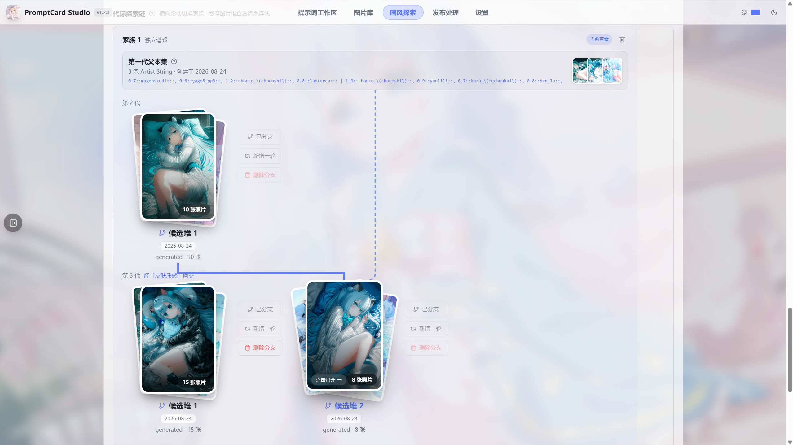

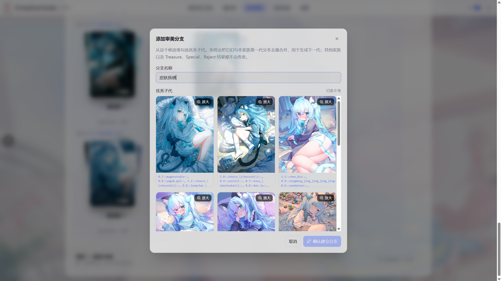

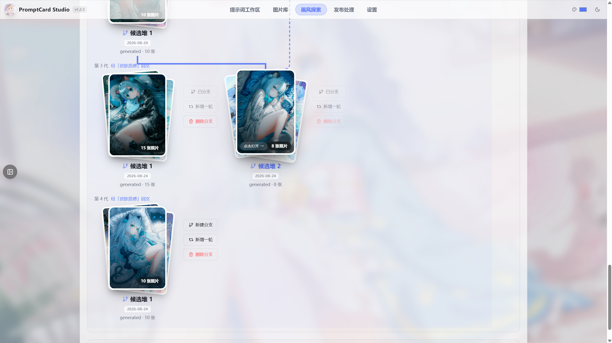

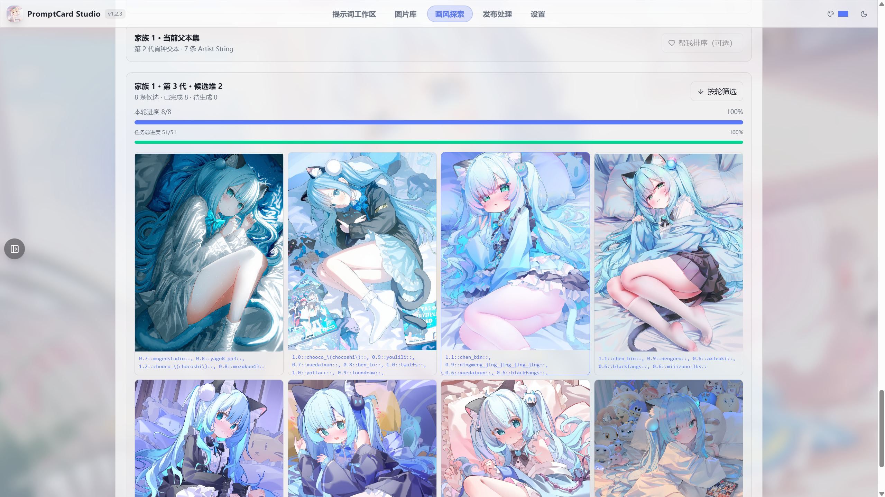

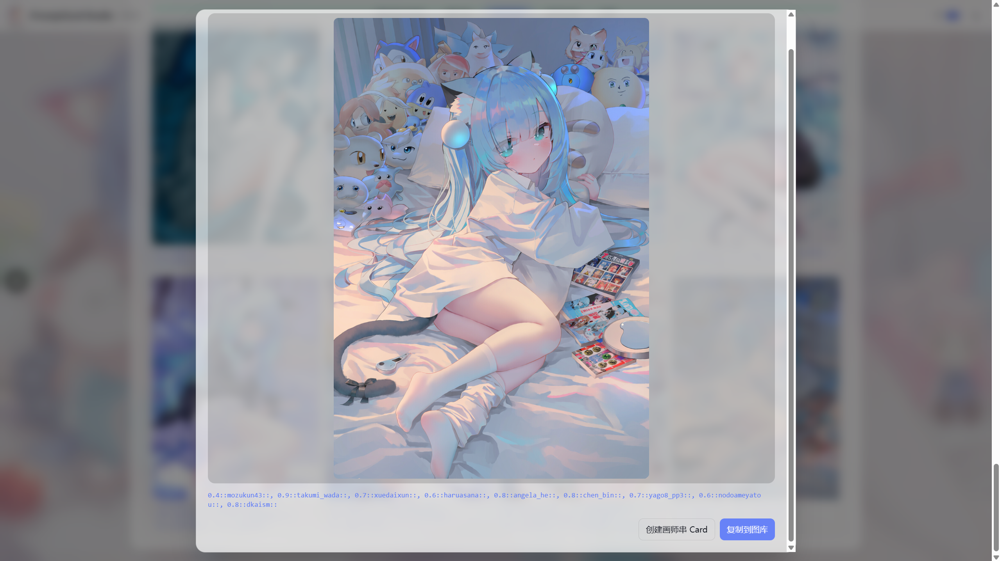

> **Note:** Batch Generation and Style Exploration share one generation channel and cannot run at the same time. The page identifies the task currently using that channel.

### Image Library

The Image Library (`图片库`) manages locally generated and imported images, with deep support for NovelAI PNG metadata.

Key features:

- **Masonry layout and date groups:** Browse images grouped by date with incremental loading.
- **Filtering:** Sort images into Treasure, Fine, Reject, and Favorites categories.
- **Restore PNG data:** Read prompts, parameters, and seeds from an image and restore them to the workspace in one click (Figure 6-2).
- **Fast import, move, and delete:** Drag local images into the library and manage them in batches.
- **Category covers:** Set any image as a category cover.

Steps:

1. Drag images into the Image Library or click **Import** (`导入`) to select local files.
2. Use the filter controls to organize them: mark strong results as Treasure and unwanted results as Reject. The library home screen is shown in Figure 0-2.
3. To recreate an image, select it and click **Restore to Workspace** (`还原到工作区`). Its prompt and parameters are restored automatically (Figure 6-2).
4. Use the context menu or action menu to move, delete, or set a cover image. These actions are described here without a dedicated screenshot.


### Publish Processing

Publish Processing (`发布处理`) is an independent workflow for preparing selected images before posting them to social platforms. Images enter a staging area and pass through a fixed sequence of processing nodes before being exported.

Key features:

- **Independent staging area:** In the Image Library, select images and choose **Quick Select → Publish Processing** (`快捷选取 → 发布处理`). Hard links copy them into staging almost instantly without changing the originals. The Publish page can preview, remove, clear, or add staged images.
- **Fixed node order:** Upscaling and denoising → automatic mosaics (optional) → restore original metadata → erase metadata → batch rename.
- **Upscaling and denoising:** Supports Real-ESRGAN through ncnn-Vulkan, with verified resumable downloads, and waifu2x-caffe through a local path.
- **Automatic mosaics:** An optional plugin. Once enabled, its node can target penis, vulva, or breasts (shown in the Chinese UI as `欧金金 / 欧芒果 / 欧派派`) and apply pixelation, blur, lines, or a solid color. Images with no detected target are skipped automatically.
- **Restore original metadata:** Write the source prompt and parameters back after upscaling so the sharper image retains its generation information.
- **Erase metadata:** Overwrite remaining metadata blocks with null values so NovelAI and similar readers see them as empty. JPEG EXIF and XMP are removed as well.
- **Batch rename:** Combine an optional date, optional custom segment, and six-digit random segment. Drag the segments to reorder them and preview names in real time.
- **Output:** Write results to a separate `outputs/<timestamp>-<random>/` directory, then open it with one click.

Steps:

1. Select images in the Image Library and choose **Quick Select → Publish Processing** (`快捷选取 → 发布处理`) to add them to staging (Figure 7-1).
2. Review the staging area on the Publish page. Preview or remove images, or add more.
3. To use automatic mosaics, click **Download and Enable** (`下载并启用`) under optional plugins and confirm the approximately 42.5 MB detection-model download. The **Automatic Mosaic** (`自动打码`) node then appears.
4. Configure the nodes in order: select an optional upscaling engine and its settings, enable automatic mosaics and choose the target and method, then enable original-metadata restoration or metadata erasure as needed. These controls are described here without a dedicated screenshot.
5. Configure the rename rule and check the live filename preview on the right (Figure 7-3).
6. Click **Start Processing** (`开始处理`). When it finishes, click **Open Output Folder** (`打开输出文件`) to view the results (Figure 7-4).


<!-- [Figure 7-3 needed] Capture the batch-renaming rule and live preview, including draggable date/custom/random segments. Suggested filename: 图7-3-发布处理-重命名预览.png -->
<!-- [Figure 7-4 needed] Capture the completion message or contents of an outputs/ directory. Suggested filename: 图7-4-发布处理-输出结果.png -->

### Vibe Management

Vibe is NovelAI's reference-image mechanism. PromptCard Studio provides a local Vibe library whose entries can be selected during single-image or batch generation.

Key features:

- **Vibe library:** Store `.naiv4vibe` reference files in one place.
- **Import, rename, and preview:** Import files in batches, rename them for easier recognition, and preview thumbnails directly.
- **Use during generation:** Select Vibes directly in the image-generation panel.

Steps:

1. Open **Vibe Management** (`Vibe 管理`), click **Import** (`导入`), and select `.naiv4vibe` files (Figure 8-1).
2. Preview and rename entries in the list.
3. Select the required Vibes when generating a single image or running Batch Generation.


### Settings

The Settings page (`设置`) manages appearance, paths, account credentials, and feature switches.

Key features:

- **Theme and background:** Dark/light themes, card-glass intensity, background blur, and built-in backgrounds.
- **Image Library path:** Uses the project's `library/` directory by default and can be changed to any absolute path.
- **NovelAI Token:** Stored only in the local `config.json`; it is never written to logs or commits.
- **Feature switches:** Visual effects, multi-character support, Chinese translation, automatic notes, and more.
- **Shut down local service:** Stop the backend safely from within the app.

Steps:

1. Open **Settings** (`设置`) and configure the appearance and Image Library path (Figure 9-1).
2. Enter your NovelAI Token and enable Chinese translation or automatic notes as desired (Figure 9-2).
3. When the service is no longer needed, click **Shut Down Local Service** (`关闭本地服务`).


## Feature Overview

- **Prompt Workspace:** A sectioned block workspace for the main prompt, characters, actions, artist strings, and negative prompt. Supports card references, free text, drag-and-drop ordering, undo/redo, prompt splitting with automatic Chinese labels, combined cards, multi-select moves, prompt merging, and positive/negative switching.
- **Prompt Card Library:** Category-based card management with pinning, XLSX bulk import (category, name, prompt, and optional image, with automatic duplicate-name suffixes), and ZIP export.
- **Prompt Dictionary:** Local Chinese annotations with automatic colors and notes by Danbooru tag category; unknown tags can be added manually.
- **NovelAI Image Generation:** Single-image generation with model, resolution, steps, sampler, negative preset, quality tags, Variety, Vibe references, and multi-character controls, with remembered parameters.
- **Batch Generation:** Combination enumeration across characters, actions, artist strings, and optional custom dimensions, with per-card multipliers, sequential generation, credit thresholds, and checkpoint resume.
- **Style Exploration:** Generate artist strings from an ArtistPool, filter them into Treasure, Special, and Reject, then use deep crossover, mutation, independent families, aesthetic branches, and sibling rounds to converge on a style. Save results as artist-string cards or regular library images.
- **Image Library:** Masonry browsing, date groups, Treasure/Fine/Reject/Favorites filtering, PNG metadata restoration, fast import/move/delete operations, and category covers.
- **Publish Processing:** Move selected images into an independent staging area and process them through upscaling and denoising, optional automatic mosaics, original-metadata restoration, metadata erasure, and draggable batch-renaming segments. Results are written to a separate `outputs/` directory.
- **Vibe Management:** Import, rename, and preview Vibe reference files.
- **Settings:** Theme, background, Image Library path, NovelAI Token, visual effects, multi-character support, Chinese translation, automatic notes, and more.

## Directory Structure

Files included with the repository or extracted package:

```
backend/          FastAPI backend: cards, workspace, dictionary, generation, batch jobs, style exploration, library, Vibes, PNG transfer, and publish processing
  └ app/assets/   XLSX card-import template
  └ app/engines/  Upscaling-engine manifests (*.json) and on-demand runtime download directory
plugins/          Optional plugins, disabled by default; their nodes appear only after activation
  └ auto_mosaics/ Automatic-mosaic plugin; downloads its detection model on first activation
frontend/         React 18 + TypeScript + Vite + Tailwind v4 + Zustand frontend
  └ src/assets/backgrounds/  Built-in backgrounds
dictionary/       Tag dictionary (tags.json), updated with project releases
promptcards/      Prompt cards (<category>/<name>.txt plus metadata) and built-in examples
library/          Local image library with built-in examples
vibes/            Vibe reference library with a built-in example
style_explore/    Style Exploration data, including a built-in ArtistPool; tasks and new data are not tracked
images/           README screenshots only
LICENSE           GPL-3.0 license
README.md         Simplified Chinese README
README_EN.md      English README
README_JA.md      Japanese README
run.bat / run.sh  Startup entry points; Windows supported, macOS/Linux experimental
start.py          Service launcher called by run.bat and run.sh
.gitignore        Excludes user data from version control
```

User data generated or added after startup is covered by `.gitignore` and is not committed:

```
promptcards/      Cards you add
library/          Your Image Library
vibes/            Your Vibe references
batch_runs/       Batch-generation checkpoints
style_explore/    Added ArtistPools, exploration tasks, candidate images, and filtering results
publish_staging/  Publish Processing staging area
publish_runs/     Internal Publish Processing runtime data
outputs/          Publish Processing output
dictionary/custom.json  Custom dictionary entries
config.json / workspace.json  Local configuration and workspace data
```

## Credits

- The NovelAI integration and batch-generation workflow reference **Auto-NovelAI-Refactor (ANR)** (https://github.com/zhulinyv/Auto-NovelAI-Refactor, GPL-3.0). In accordance with GPL-3.0, this project as a whole is released under GPL-3.0; see `LICENSE`.
- The Chinese prompt dictionary is converted from the tag database in **DanbooruSearchOnline (DSO)** (https://github.com/SuzumiyaAkizuki/DanbooruSearchOnline; tag data is fully open source).
- Upscaling engines: **Real-ESRGAN** (https://github.com/xinntao/Real-ESRGAN, BSD-3-Clause; downloaded on demand) and optional **waifu2x-caffe** (https://github.com/lltcggie/waifu2x-caffe, MIT; connected through a local path).
- Automatic-mosaic plugin: the **censor_detect_v1.0_s** detection model comes from **deepghs/anime_censor_detection** (https://huggingface.co/deepghs/anime_censor_detection; trained with YOLOv8, MIT; downloaded when the plugin is enabled). Inference uses **ONNX Runtime** (https://github.com/microsoft/onnxruntime, MIT). The **YOLOv8 / ultralytics** architecture and export tools (https://github.com/ultralytics/ultralytics, AGPL-3.0) are used only when exporting the model. The mosaic algorithm references ANR's **anr_plugin_auto_mosaics** plugin (https://github.com/zhulinyv/Auto-NovelAI-Refactor, GPL-3.0).

## Privacy and Security

- The app runs locally. It sends data to no external service except when you explicitly start a NovelAI generation request. Upscaling engines are downloaded from official or mirror sources only when selected. The automatic-mosaic detection model is downloaded once only after you confirm activation; all processing remains local and images are never uploaded.
- Your NovelAI Token is stored only in the local configuration file and never appears in API responses, logs, or commits. Configuration files and user-data directories are covered by `.gitignore` and do not enter the repository.
- Never commit your Token, local configuration, or user-data directories to a public repository.
